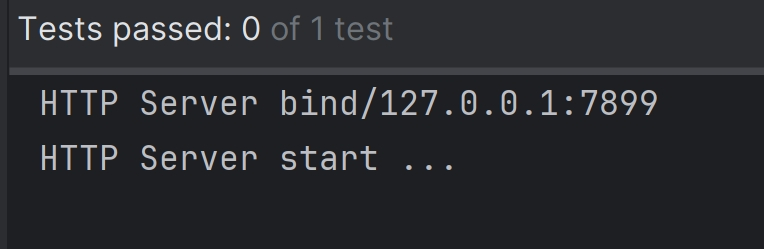
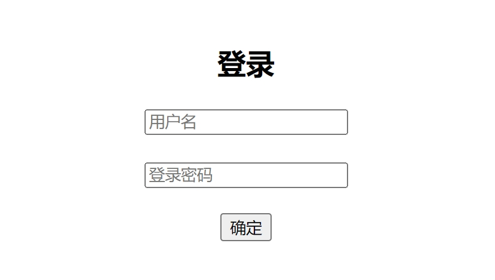
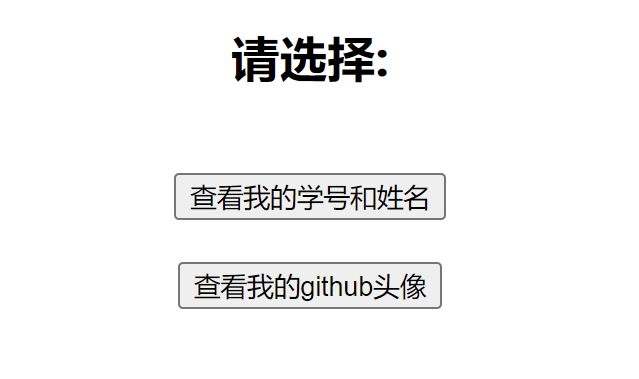

## java版 webserver

### Introduction
- 用java将cpp版的webserver重写了一遍，<br>
- 只依赖mysql驱动以及junit外部jar包，<br>
- 包含日志模块、定时器、http模块，其中http模块使用主从状态机解析支持GET和POST请求，
- 使用java的NIO模仿cpp版中的epoll的IO多路复用<br>

### Usage
1. 用init.sql初始化数据库

2. 执行testHttpServer.java文件的test

``` java
package org.jingtao8a.test;

import org.jingtao8a.server.HTTPServer;
import org.junit.Test;

import java.net.InetSocketAddress;

public class testHttpServer {
    @Test
    public void testHttpServer() {
        HTTPServer httpServer = new HTTPServer(new InetSocketAddress("127.0.0.1", 7899));
        httpServer.start();
    }
}
```

### Display
<br>

1. 登入 or 注册<br>
 


2. 查看信息<br>

